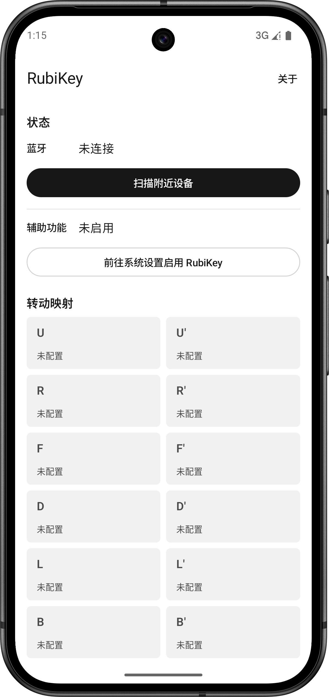
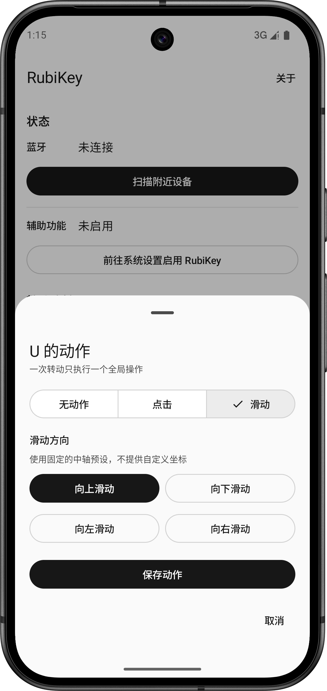

  

  <h1>RubiKey-Android</h1>

  

    将智能魔方的转动映射为 Android 设备上的全局手势操作
  

  

    
    
    
    
  

  
  

---

## 功能/特点

- 多品牌兼容（ GAN / Moyu / Qiyi ）
- 使用无障碍服务（AccessibilityService）调用全局手势
- 12 种转动自由配置不同的操作
- 页面设计基于 MD3，简洁易用

## 许可证

GPLv3
